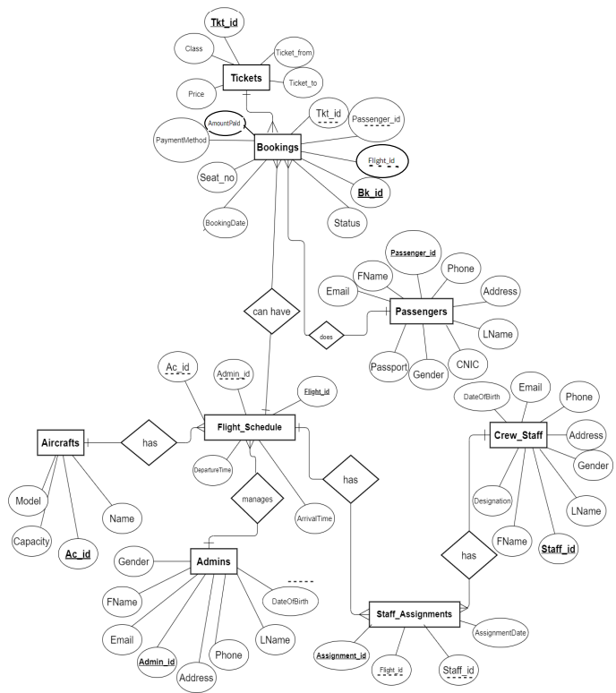

# Airline Management System

## Overview
This project is a **Database Design Project** created in **SQL Server**. In this project, I have designed an efficient schema, developed both complex and simple views, and implemented triggers and stored procedures to streamline data management and reporting. Additionally, I designed a **custom data generation library in Python** tailored to this project to maintain the integrity of the data.

The system manages **Flight Scheduling**, **Bookings**, **Ticket Management**, **Passenger Information**, **Aircrafts**, and **Crew Staff Assignments**. The project also supports the generation of **analytical and daily reports**.

The database follows a structured ERD (Entity Relationship Diagram) that outlines the relationships between different entities in the system.

## ERD Overview


The diagram shows the relationships between key entities such as `Bookings`, `Tickets`, `Passengers`, `Flight Schedule`, `Crew Staff`, and more. Each entity is connected to others based on the roles they play in the system, ensuring a seamless and efficient data flow.

## Entities and Relationships

### 1. **Passengers**
- Stores passenger details such as:
  - `Passenger_id` (Primary Key)
  - `FName` (First Name)
  - `LName` (Last Name)
  - `Email`
  - `Phone`
  - `Gender`
  - `Address`
  - `CNIC`
  - `Passport`
  - `DateOfBirth`
- **Relationship:** A passenger can book multiple tickets.

### 2. **Tickets**
- Contains ticket-related information:
  - `Tkt_id` (Primary Key)
  - `Class` (Ticket class such as Economy, Business)
  - `Ticket_from` (Source)
  - `Ticket_to` (Destination)
  - `Price`
  - `AmountPaid`
  - `PaymentMethod`
- **Relationship:** Each ticket is associated with a specific booking.

### 3. **Bookings**
- Tracks each booking made by a passenger:
  - `Bk_id` (Primary Key)
  - `Seat_no`
  - `BookingDate`
  - `Status`
- **Relationship:** A booking can contain multiple tickets and is linked to passengers and flight schedules.

### 4. **Flight Schedule**
- Manages flight timings and aircraft assignments:
  - `Flight_id` (Primary Key)
  - `DepartureTime`
  - `ArrivalTime`
  - `Ac_id` (Aircraft ID)
  - `Admin_id` (Administrator managing the schedule)
- **Relationship:** Each flight is linked to an aircraft and managed by an admin.

### 5. **Aircrafts**
- Stores details about the airline's fleet:
  - `Ac_id` (Primary Key)
  - `Model`
  - `Capacity`
  - `Name`

### 6. **Admins**
- Administrators responsible for managing flight schedules:
  - `Admin_id` (Primary Key)
  - `FName`
  - `LName`
  - `Email`
  - `Phone`
  - `Address`
  - `Gender`
  - `DateOfBirth`

### 7. **Crew Staff**
- Contains details of airline staff members:
  - `Staff_id` (Primary Key)
  - `FName`
  - `LName`
  - `Email`
  - `Phone`
  - `Gender`
  - `Address`
  - `Designation`
- **Relationship:** Staff members are assigned to specific flights.

### 8. **Staff Assignments**
- Manages which staff are assigned to which flights:
  - `Assignment_id` (Primary Key)
  - `Flight_id` (Foreign Key linking to Flight Schedule)
  - `Staff_id` (Foreign Key linking to Crew Staff)
  - `AssignmentDate`

## Database Flow

1. **Passengers** book **Tickets**, which are stored in the **Bookings** table.
2. **Bookings** are linked to **Flight Schedules**, which detail the **Departure** and **Arrival** of flights.
3. Each **Flight** is managed by an **Admin** and is assigned to an **Aircraft**.
4. **Crew Staff** are assigned to flights through the **Staff Assignments** table, ensuring every flight has the required personnel.
5. **Admins** handle the **Flight Schedules** and manage the entire process.

To set up this project on your local machine, follow these steps:

1. Clone the repository:
    ```bash
    git clone <repository-url>
    ```
## Usage

This system can be used by airlines to manage:
- Passenger ticket bookings.
- Flight schedules and aircraft management.
- Crew staff assignments.
- Admin operations for managing the airline.


